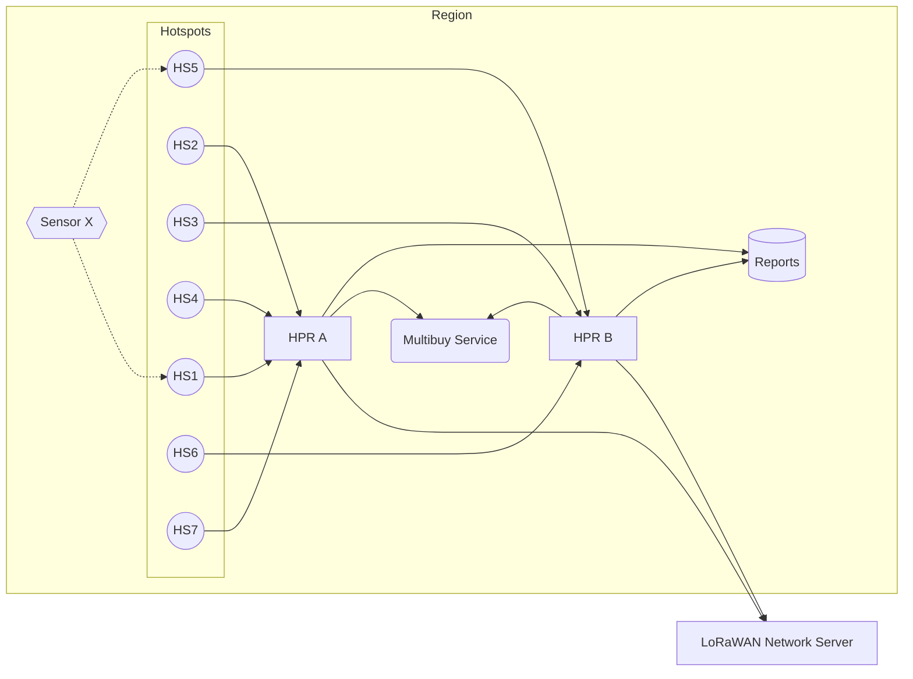

# Multibuy Service
In the Helium Packet Router architecture, there are multiple load balanced HPRs per region (Europe, Asia, etc). This presents the chance that two geographically close Hotspots in one region actually report to different instances of HPR. Through this double connection, HPRs alone cannot determine whether a packet has already been purchased by the network already.

e.g. One Hotspot reports to HPR A, One Hotspot reports to HPR B. The 'multibuy' is set to 'one', the network may incorrectly transmit two packet reports to the LNS (and packet verifier).

Multi-Buy service fixes this non-communication by allowing HPRs to communicate within a region in order to limit the number of packets purchased by the network (based on multi-buy preference).

As packet reports come in to HPR A and HPR B, they will check in with Multi-Buy service to ensure the total requested packets is not exceeded. 

## Diagram

